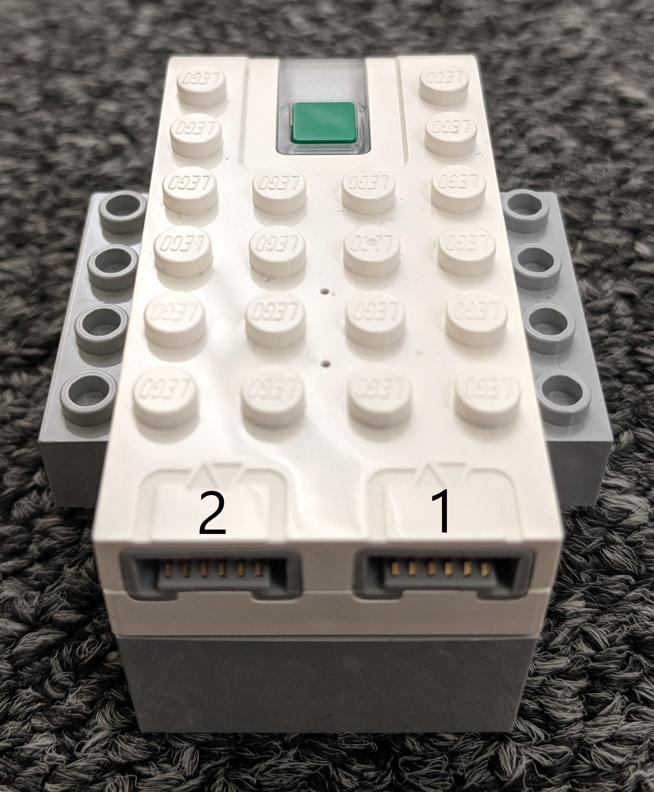

# WeDo-BT control wrapper class

This library interacts with the LEGO® WeDo 2.0 system. Unlike the native WeDo software, this library allows for multiple WeDos to connect and commicate, with the computer as an intermediary. We use [Bleak](https://github.com/hbldh/bleak), an asynchronous platform agnostic Bluetooth Low Energy (BLE) library to communcate with the WeDos.

## Install
This library uses Python 3.6.8 or above

Install Bleak by typing the following command into your terminal: `pip install bleak` 

Then, clone or download this repository and move `WeDo2.py` and `__init__.py` into your working directory

## Usage
Programs will typically follow this structure:
```python
from WeDo2 import *
import asyncio as aio

async def main ():
	h = HubManager(x)
	await h.connect_all()
	
	wedo_0 = h.wedos[0]
	device = await wedo_0.attach(port_number, Attachment())
	
	await wedo_0.set_sensor_callback(port_number, callback)
	await device.set_speed(speed) 
	
	while True:
		await h.end(False)
		# do your logic here

loop.run_until_complete(main())
```
`h = HubManager(x)`: initializes a HubManager
- `x`: the number of WeDos you wish to use.

`await h.connect_all()`: connect all of the WeDos
`await wedo_0.attach(port_number, Attachment())`: register a peripheral on a port number
- `port_number`: the port the peripheral is on
- `Attachment()`: an instance of the peripheral

`await wedo_0.set_sensor_callback(port_number, callback)`: set a callback for sensor updates, if `device` is a sensor
- `port_number`: the port number of the sensor
- `callback`: the function that will be called each sensor update

`await device.set_speed(speed) `: if `device` is a motor, you can set it's speed
- `speed`: A value between -1 and 1, inclusive

`await h.end(False)`: Wait for the program to end
- `False`: `True`=blocking (hold program until it ends), `False`=nonblocking(check, but then move on; good for loops)

<br>

If you're wondering which how the ports are numbered:

<div align="center"></div>

## Examples
You can find more information in `examples/`